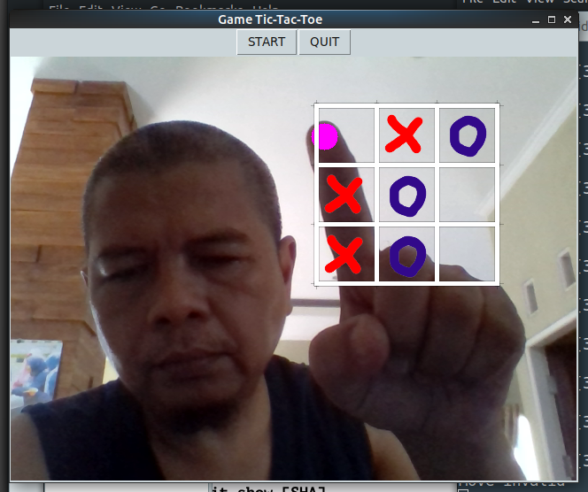

# Play-TicTacToe - Game

Aplikasi Python ini merupakan permainan Tic-Tac-Toe yang sangat popular. Pemain ditugaskan untuk menempatkan bidaknya pada kotak-kotak tersedia secara bergantian dengan lawannya. Pemain yang terlebih dahulu menyusun 3 bidaknya sehingga segaris secara horisontal, vertikal atau diagonal, dialah yang memenangkan permainan. 

## Cara main

1. Tekan tombol [Start]
2. Pada saat giliran, tunjuk dengan ujung jari telunjuk pada kotak dimana bidak akan dipasang
3. Ulangi sehingga menang atau menghalangi lawan agar tidak menang.
5. Tekan [Start] jika ingin memulai lagi
6. Tekan tombol [Quit] jika ingin berhenti

## Video

Jika link di atas tidak berfungsi, silakan copy paste

    https://www.youtube.com/watch?v=g6DOW_CXc4c

## Algoritma

Game dibuat dengan bahasa pemrograman Python3 berbasis GUI dengan TkInter dan menerapkan modul-modul OpenCV, mediapipe untuk mendapatkan landmark jari-jari tangan, sehingga dapat dianalisa kotak yang mana yang ditunjuk oleh pemain.

Bagi saya, program ini media pembelajaran untuk memahami OpenCV, mediapipe dan melatih kemampuan algoritma pemrograman.

Berikut adalah modul-modul yang diimport oleh program:

    import tkinter as tk
    import cv2
    import mediapipe as mp
    import numpy
    import time
    import random
    import PIL.Image, PIL.ImageTk, PIL.ImageDraw, PIL.ImageFont

Class Game berisi Algoritma Tic-Tic-Toe dengan metode minimax yang diadaptasi dari sourcecode divyesh072019

Silakan download /pull untuk dipelajari atau dikembangkan

